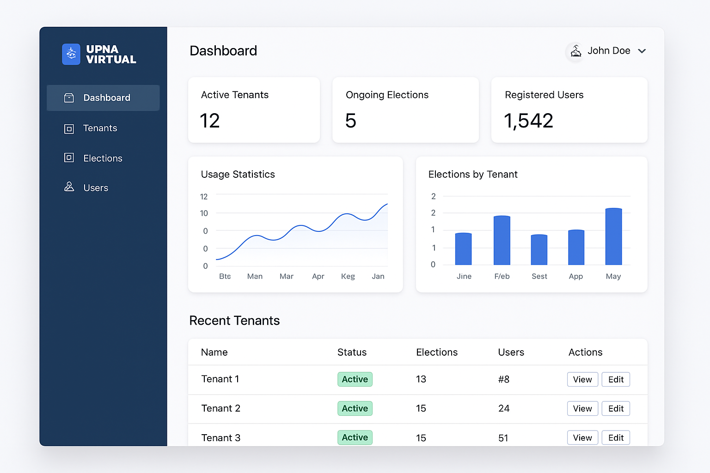
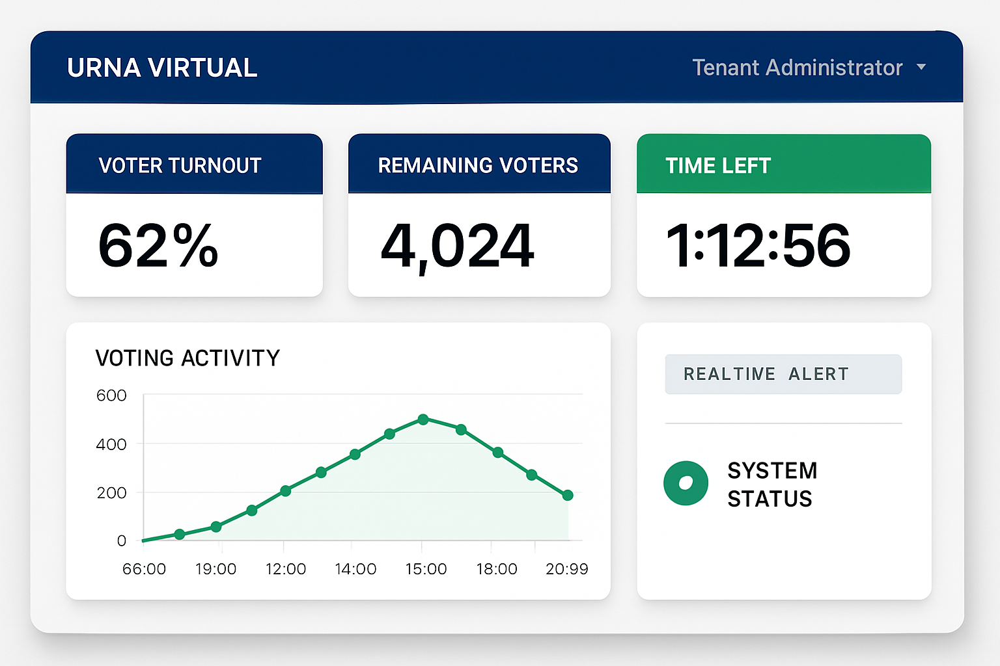

# Urna Virtual - Sistema de Voto Electrónico


## 📋 Descripción

**Urna Virtual** es una aplicación web SaaS completa para votación electrónica, diseñada para organizaciones de todo tipo en sus procesos de elección de autoridades. El sistema está enfocado en la **seguridad**, **transparencia** y **confidencialidad** desde su origen.

## 🏗️ Arquitectura

- **Frontend**: React.js con TypeScript
- **Backend**: Python con FastAPI
- **Base de Datos**: PostgreSQL
- **Autenticación**: JWT (JSON Web Tokens)
- **Arquitectura**: Multitenant
- **Seguridad**: Cumple normas OWASP

## ✨ Características Principales

### 🔐 Seguridad y Transparencia
- **Cifrado de extremo a extremo** para todos los votos
- **Firmas digitales** para garantizar integridad
- **Sistema de blockchain simplificado** para auditoría
- **Autenticación JWT** con refresh tokens
- **Autorización basada en roles** (RBAC)

### 🏢 Arquitectura Multitenant
- **Gestión de múltiples organizaciones** en una sola plataforma
- **Aislamiento completo** de datos entre tenants
- **Configuración independiente** por organización
- **Facturación basada en uso**

### 🗳️ Sistema de Votación
- **Voto único, secreto e intransferible**
- **Gestión de candidatos** con fotos y información
- **Simulacros de votación** para pruebas
- **Apertura/cierre automático** según zona horaria
- **Métricas en tiempo real** (sin revelar resultados)

### 👥 Roles de Usuario
- **Super Administrador**: Gestión global de la plataforma
- **Administrador de Tenant**: Gestión de elecciones y usuarios
- **Votante**: Participación en procesos electorales

## 🚀 Funcionalidades Implementadas

### Backend (FastAPI)
- ✅ **40+ APIs REST** completamente documentadas
- ✅ **Sistema de autenticación** con JWT
- ✅ **Gestión de tenants** y usuarios
- ✅ **Gestión de elecciones** y candidatos
- ✅ **Sistema de votación** con cifrado
- ✅ **Simulacros de votación**
- ✅ **Métricas en tiempo real**
- ✅ **Reportes de facturación**
- ✅ **Gestión de imágenes**
- ✅ **Validaciones de seguridad**

### Frontend (React.js)
- ✅ **Interfaz de autenticación** completa
- ✅ **Dashboard diferenciado** por roles
- ✅ **Interfaz de votación** intuitiva
- ✅ **Métricas en tiempo real** con gráficos
- ✅ **Sistema de notificaciones**
- ✅ **Reportes para Super Admin**
- ✅ **Diseño responsive** y accesible
- ✅ **Componentes reutilizables**

## 📁 Estructura del Proyecto

```
urna-virtual-project/
├── backend/                 # Código del backend (FastAPI)
│   ├── src/
│   │   ├── database/       # Configuración de base de datos
│   │   ├── models/         # Modelos SQLAlchemy
│   │   ├── routes/         # Endpoints de la API
│   │   ├── schemas/        # Esquemas Pydantic
│   │   ├── services/       # Lógica de negocio
│   │   └── utils/          # Utilidades y helpers
│   ├── requirements.txt    # Dependencias Python
│   └── init_db.py         # Script de inicialización
├── frontend/               # Código del frontend (React.js)
│   ├── src/
│   │   ├── components/     # Componentes React
│   │   ├── contexts/       # Contextos de React
│   │   ├── lib/           # Configuración de APIs
│   │   └── assets/        # Recursos estáticos
│   ├── package.json       # Dependencias Node.js
│   └── index.html         # Página principal
├── docs/                  # Documentación del proyecto
│   ├── functional_design.md
│   ├── technical_design.md
│   ├── ux_ui_design.md
│   └── todo.md
├── assets/                # Recursos del proyecto
│   ├── urna_virtual_logo.png
│   ├── mockups/
│   └── screenshots/
└── README.md             # Este archivo
```

## 🛠️ Instalación y Configuración

### Prerrequisitos
- Python 3.11+
- Node.js 20+
- PostgreSQL 14+
- Git

### Backend (FastAPI)

```bash
cd backend
python -m venv venv
source venv/bin/activate  # En Windows: venv\Scripts\activate
pip install -r requirements.txt

# Configurar base de datos
python init_db.py

# Ejecutar servidor
python src/main.py
```

El backend estará disponible en: `http://localhost:5000`
Documentación API: `http://localhost:5000/docs`

### Frontend (React.js)

```bash
cd frontend
npm install  # o pnpm install

# Ejecutar servidor de desarrollo
npm run dev  # o pnpm run dev
```

El frontend estará disponible en: `http://localhost:5173`

## 👤 Usuarios de Prueba

El sistema incluye usuarios de prueba para testing:

| Rol | Email | Contraseña | Descripción |
|-----|-------|------------|-------------|
| Super Admin | admin@test.com | password123 | Acceso completo al sistema |
| Tenant Admin | admin@tenant.com | admin123 | Gestión de elecciones |
| Votante | voter@test.com | voter123 | Participación en votaciones |

## 🔧 APIs Principales

### Autenticación
- `POST /api/v1/auth/login` - Iniciar sesión
- `POST /api/v1/auth/refresh` - Renovar token
- `GET /api/v1/auth/me` - Obtener usuario actual
- `POST /api/v1/auth/logout` - Cerrar sesión

### Gestión de Tenants
- `GET /api/v1/tenants/` - Listar tenants
- `POST /api/v1/tenants/` - Crear tenant
- `PUT /api/v1/tenants/{id}` - Actualizar tenant
- `DELETE /api/v1/tenants/{id}` - Eliminar tenant

### Votación
- `POST /api/v1/votos/` - Emitir voto
- `GET /api/v1/votos/eleccion/{id}/resultados` - Obtener resultados
- `GET /api/v1/votos/eleccion/{id}/participacion` - Estadísticas

### Métricas y Reportes
- `GET /api/v1/metricas/eleccion/{id}/tiempo-real` - Métricas en vivo
- `GET /api/v1/reportes/super-admin/uso-plataforma` - Reportes de facturación

## 🎨 Capturas de Pantalla

### Página de Login


### Dashboard del Super Administrador


### Interfaz de Votación


### Métricas en Tiempo Real


## 🔒 Seguridad

El sistema implementa múltiples capas de seguridad:

- **Cifrado AES-256** para datos sensibles
- **Firmas digitales RSA** para integridad
- **Hashing bcrypt** para contraseñas
- **Validación de entrada** en todos los endpoints
- **Rate limiting** para prevenir ataques
- **CORS configurado** correctamente
- **Headers de seguridad** implementados

## 📊 Métricas y Monitoreo

- **Métricas en tiempo real** de participación
- **Dashboards interactivos** con gráficos
- **Reportes de facturación** automáticos
- **Auditoría completa** de todas las acciones
- **Logs detallados** para debugging

## 🚀 Despliegue

### Desarrollo
```bash
# Backend
cd backend && python src/main.py

# Frontend
cd frontend && npm run dev
```

### Producción
```bash
# Backend
cd backend && uvicorn src.main:app --host 0.0.0.0 --port 5000

# Frontend
cd frontend && npm run build
```

## 📝 Documentación Adicional

- [Diseño Funcional](./docs/functional_design.md)
- [Diseño Técnico](./docs/technical_design.md)
- [Diseño UX/UI](./docs/ux_ui_design.md)
- [Lista de Tareas](./docs/todo.md)

## 🤝 Contribución

1. Fork el proyecto
2. Crea una rama para tu feature (`git checkout -b feature/AmazingFeature`)
3. Commit tus cambios (`git commit -m 'Add some AmazingFeature'`)
4. Push a la rama (`git push origin feature/AmazingFeature`)
5. Abre un Pull Request

## 📄 Licencia

Este proyecto está bajo la Licencia MIT. Ver el archivo `LICENSE` para más detalles.

## 👨‍💻 Autor

Desarrollado por el equipo de Manus AI como parte del proyecto de sistema de votación electrónica.

## 🙏 Agradecimientos

- FastAPI por el excelente framework de backend
- React.js por la flexibilidad del frontend
- Tailwind CSS por el sistema de diseño
- PostgreSQL por la robustez de la base de datos

---

**Urna Virtual** - Sistema de Voto Electrónico Seguro y Transparente 🗳️✨

